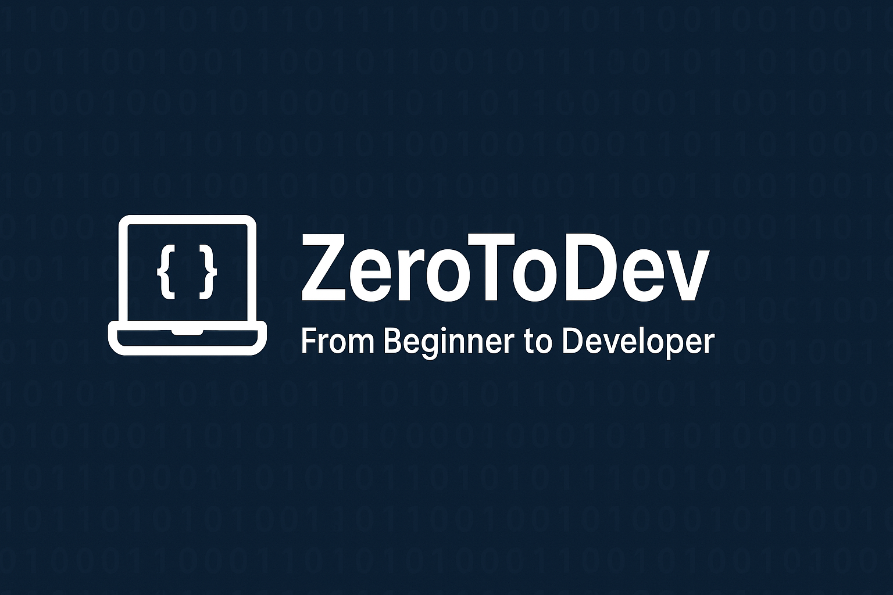

# ZeroToDev

  
  🚀 A complete roadmap from coding basics to becoming a professional developer – fundamentals, projects, and interview prep.

## 📌 About  
This repository is designed as a roadmap for developers, covering everything from the fundamentals of programming to cracking technical interviews and building real-world projects.  

Here you’ll find:  
- 💡 Programming concepts & logic building  
- 📝 Example codes with clear explanations  
- 🎯 Coding challenges & interview preparation  
- 💻 Projects across multiple languages & domains  
- 📄 Resume tips & career guidance  

Whether you’re starting from scratch or sharpening your skills for your next role, this repo is your guide to going **Zero → Developer**.  

---

## 📂 Repository Structure

---

## 📖 Contents  

### 🔹 Concepts  
- Data Structures & Algorithms  
- Object-Oriented Programming (OOP)  
- Database Management Systems (DBMS)  
- Operating Systems & Networking basics  

### 🔹 Coding Challenges  
- Problem-solving & logic building  
- Common interview-style coding questions  
- Hands-on exercises  

### 🔹 Projects  
- Beginner-friendly mini projects  
- Intermediate applications  
- Full-stack & advanced projects  

### 🔹 Interview Prep  
- Frequently asked coding questions  
- HR & behavioral interview guidance  
- System design & problem-solving strategies  

### 🔹 Career & Resume  
- Resume templates & best practices  
- How to showcase your projects on GitHub  
- Career tips for developers  

---

## 📌 How to Use  
1. Pick a topic from **Concepts** to strengthen fundamentals.  
2. Solve **Challenges** to practice problem-solving.  
3. Explore **Projects** to apply knowledge in real-world scenarios.  
4. Use **InterviewPrep** to gear up for interviews.  
5. Enhance your **ResumeTips** section for career growth.  

---

## 🤝 Contributing  
Contributions are welcome! You can:  
- Add new coding challenges  
- Suggest improvements to explanations  
- Share your interview experiences  
- Add resources & project ideas  

---

## ⭐ Support  
If you find this repo helpful, please **star ⭐** it to support the project!  

